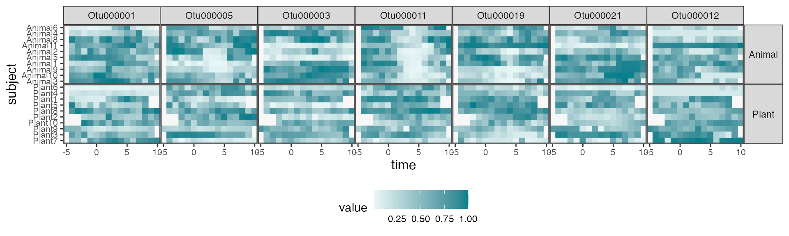
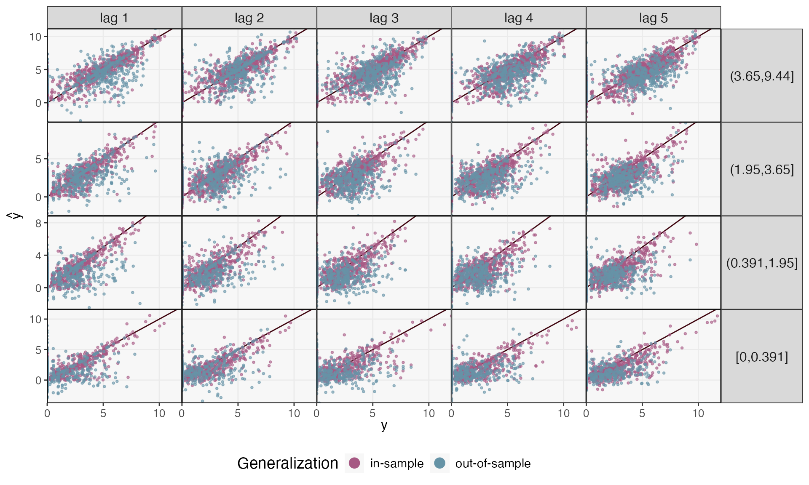
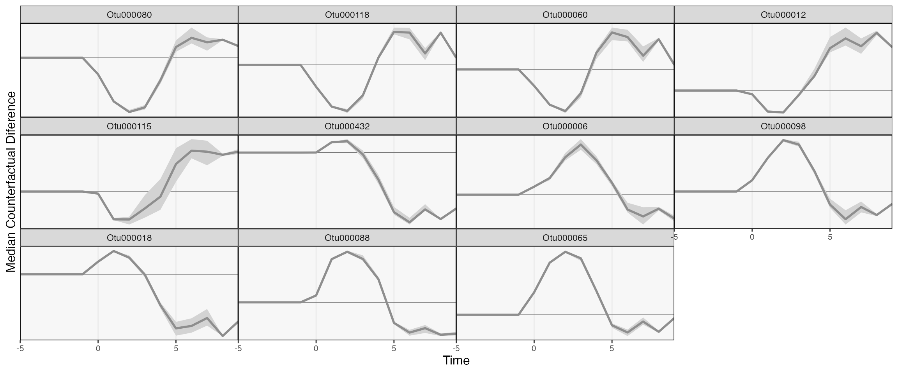
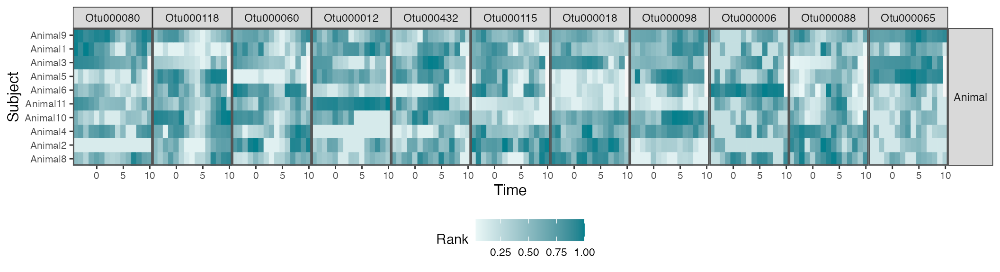
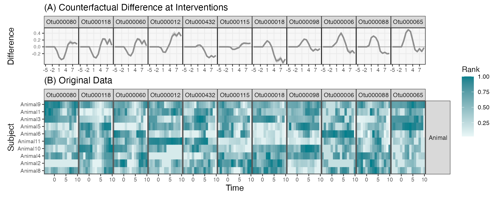

# Diet Interventions as Ecological Shifts

### Data and Problem Context

(David, Maurice, Carmody, Gootenberg, Button, Wolfe, Ling, Devlin,
Varma, Fischbach, Biddinger, Dutton, and Turnbaugh, 2013) was one of the
first studies to draw attention to the way the human microbiomes could
quickly respond to changes in host behavior. This had implications for a
lot of how we think of the microbiome in health and disease – it
wouldn’t make sense to try engineering/manipulating human microbiomes if
it were not as sensitive to external change as the study found.

The study includes 20 participates, half of whom were assigned to
“plant” and “animal” diet interventions. Samples were collected over two
weeks, and during (what must have been a quite memorable…) five
consecutive days of the study, participants were instructed to only eat
foods from their intervention diet type. If you think of the microbiome
as an ecosystem, such a dramatic shift in diet could be likened to an
extreme environmental event, like a flood or a wildfire. The question
was how the microbiome changed in response – which taxa (if any) were
affected, and how long did the intervention effects last.

Before diving into the data, let’s load some libraries. The `th`
definition is just used to customize the default `ggplot2` figure
appearance.

``` r

library(mbtransfer)
library(tidyverse)
library(glue)
library(tidymodels)
library(patchwork)
th <- theme_bw() +
  theme(
    panel.grid.minor = element_blank(),
    panel.background = element_rect(fill = "#f7f7f7"),
    panel.border = element_rect(fill = NA, color = "#0c0c0c", linewidth = 0.6),
    axis.text = element_text(size = 8),
    axis.title = element_text(size = 12),
    legend.position = "bottom"
  )
theme_set(th)
set.seed(20230524)
```

The block below reads in the data. These are [lightly
processed](https://github.com/krisrs1128/microbiome_interventions/blob/main/scripts/data_preprocessing.Rmd)
versions of data hosted in the [`MITRE`
repository](https://github.com/gerberlab/mitre/tree/master/mitre/example_data/david)
(Bogart, Creswell, and Gerber, 2019). We’ve selected only those features
that are used in this analysis, and we have reshaped the data into a
format that can be used by our `ts_from_dfs` function.

``` r

subject <- read_figshare_csv("https://figshare.com/ndownloader/files/40275934/subject.csv")
interventions <- read_figshare_csv("https://figshare.com/ndownloader/files/40279171/interventions.csv") |>
  column_to_rownames("sample")
reads <- read_figshare_csv("https://figshare.com/ndownloader/files/40279108/reads.csv") |>
  column_to_rownames("sample")
samples <- read_figshare_csv("https://figshare.com/ndownloader/files/40275943/samples.csv")
```

Next, we unify the read counts, subject variables, and intervention
status into a `ts_inter` class. All of `mbtransfer`’s functions expect
data structured according to this class. We interpolate all the
timepoints onto a daily grid. This is not the most satisfying
transformation, since it can create the impression that there is not
much noise between samples. However, it is common practice (e.g.,
`r`Citep(bib, “RuizPerez2019DynamicBN”)\`), and it is better than
entirely ignoring variation in the gaps between samples.

``` r

ts <- as.matrix(reads) |>
  ts_from_dfs(interventions, samples, subject) |>
  interpolate(method = "linear")

ts
#> # A ts_inter object | 191 taxa | 20 subjects | 14.40 ± 1.56 timepoints:
#> 
#> Plant5:
#>           Plant5_T1 Plant5_T2 Plant5_T3 Plant5_T4  
#> Otu000001    10.218     9.149     8.392     9.399 …
#> Otu000002         0         0      5.15     8.454 …
#> Otu000003     6.413         0     3.509      3.57 …
#> Otu000004      7.46     6.997     6.855      8.04 …
#>                   ⋮         ⋮         ⋮         ⋮ ⋱
#> 
#> Plant7:
#>           Plant7_T1 Plant7_T2 Plant7_T3 Plant7_T4  
#> Otu000001     9.311     9.368     8.052     9.734 …
#> Otu000002         0         0     4.838     1.844 …
#> Otu000003     7.201     7.575     5.674     7.127 …
#> Otu000004     9.375     9.591     8.313     9.435 …
#>                   ⋮         ⋮         ⋮         ⋮ ⋱
#> 
#> Plant4:
#>           Plant4_T1 Plant4_T2 Plant4_T3 Plant4_T4  
#> Otu000001     8.176     8.344     8.512     8.398 …
#> Otu000002     4.545     2.272         0         0 …
#> Otu000003     8.471     8.349     8.226     7.954 …
#> Otu000004         0         0         0         0 …
#>                   ⋮         ⋮         ⋮         ⋮ ⋱
#> 
#> and 17 more subjects.
```

Before doing any modeling, let’s visualize some of the raw data. The
plot below shows interpolated series for the seven most abundant taxa.
For some subjects, there is a clear, nearly universal affect – e.g.,
OTU000011 is clearly depleted in the Animal diet. Other taxa have more
ambiguous effects (does OTU000019. increase in plant?), or seem
potentially specialized to subpopulations (e.g., OTU000003 in Animal).
Our transfer function models should help us provide a precise
characterization of the intervention effects, together with some
uncertainty quantification.

``` r

values_df <- pivot_ts(ts)
top_taxa <- values_df |>
  group_by(taxon) |>
  summarise(mean = mean(value)) |>
  slice_max(mean, n = 7) |>
  pull(taxon)

values_df |>
  group_by(taxon) |>
  mutate(value = rank(value) / n()) |>
  interaction_hm(top_taxa, "diet")
```



### Prediction

Before we can get to those more formal statistical inferences, let’s see
how accurate the transfer function model is – there is no point
attempting to interpret effects in a model that doesn’t fit the data!
First, we are going to remove the intervention group label. `mbtransfer`
will include any column of `subject_data(ts)` in the regression model,
and since we already record intervention state in the `interventions`
slot of the `ts` object, including a feature about the group label
doesn’t add any real information.

``` r

subject_data(ts) <- subject_data(ts) |>
  select(-diet)
```

We’ll first fit a transfer function model using the first eight,
pre-intervention timepoints from every subject. It’s possible that this
model might overfit to the (relatively small) sample, but it’s still
usually helpful to compare in and out-of-sample prediction performance.
This is because poor performance even within the in-sample setting might
mean the assumed model class is not rich enough.

``` r

fits <- list()
ts_preds <- list()

fits[["in-sample"]] <- mbtransfer(ts, P = 2, Q = 2)
ts_missing <- subset_values(ts, 1:8)
ts_preds[["in-sample"]] <- predict(fits[["in-sample"]], ts_missing)
```

The block below instead trains on five subjects from each intervention
group and makes predictions for those who were held out.

``` r

fits[["out-of-sample"]] <- mbtransfer(ts[c(1:5, 11:15)], P = 2, Q = 2)
ts_preds[["out-of-sample"]] <- predict(fits[["out-of-sample"]], ts_missing[c(6:10, 16:20)])
```

Let’s compare the two types of prediction performance. We’ll consider
several time horizons – using the sequence of $`\hat{y}_{t + h}`$ to
make predictions of $`\hat{y}_{t + h + 1}`$ – and distinguish between
taxa with lower/higher overall abundance. Our predictions seem
reasonable for the higher abundance taxa. However, the blue points are
more spread out than the purple in the bottom panels, meaning that our
model has overfit the lower abundance taxa. This is perhaps not
surprising: The core microbiome might be shared across all 20
participants, but the person-to-person variability might be too high for
us to make reasonable generalizations for less abundant taxa.

``` r

reshaped_preds <- map_dfr(ts_preds, ~ reshape_preds(ts, .), .id = "generalization") |>
  filter(h > 0, h < 6)

reshaped_preds |>
  mutate(h = glue("lag {h}")) |>
  ggplot() +
  geom_abline(slope = 1, col = "#400610") +
  geom_point(aes(y, y_hat, col = generalization), size = .7, alpha = .6) +
  facet_grid(factor(quantile, rev(levels(quantile))) ~ h, scales = "free_y") +
  labs(x = expression(y), y = expression(hat(y)), col = "Generalization") +
  scale_x_continuous(expand = c(0, 0), n.breaks = 3) +
  scale_y_continuous(expand = c(0, 0), n.breaks = 3) +
  scale_color_manual(values = c("#A65883", "#6593A6")) +
  guides("color" = guide_legend(override.aes = list(size = 4, alpha = 1))) +
  theme(
    axis.text = element_text(size = 10),
    panel.spacing = unit(0, "line"),
    strip.text.y = element_text(angle = 0, size = 12),
    strip.text.x = element_text(angle = 0, size = 12),
    legend.title = element_text(size = 14),
    legend.text = element_text(size = 11),
  )
```



We can make this interpretation more precise by calculating in and
out-of-sample correlations across panels. Correlation can vary
substantially across lag and quantile of abundance, though, ranging from
$`\hat{\rho} = 0.148`$ to 0.578. In contrast, the within-subject
forecasts are much better, ranging from 0.725 to 0.896.

``` r

reshaped_preds |>
  group_by(h, quantile, generalization) |>
  summarise(correlation = round(cor(y, y_hat), 4)) |>
  pivot_wider(names_from = "generalization", values_from = "correlation") |>
  arrange(desc(quantile), h)
#> # A tibble: 20 × 4
#> # Groups:   h, quantile [20]
#>        h quantile     `in-sample` `out-of-sample`
#>    <dbl> <fct>              <dbl>           <dbl>
#>  1     1 (3.65,9.44]        0.896           0.587
#>  2     2 (3.65,9.44]        0.835           0.496
#>  3     3 (3.65,9.44]        0.815           0.430
#>  4     4 (3.65,9.44]        0.807           0.468
#>  5     5 (3.65,9.44]        0.822           0.456
#>  6     1 (1.95,3.65]        0.867           0.574
#>  7     2 (1.95,3.65]        0.800           0.421
#>  8     3 (1.95,3.65]        0.733           0.261
#>  9     4 (1.95,3.65]        0.727           0.376
#> 10     5 (1.95,3.65]        0.759           0.325
#> 11     1 (0.391,1.95]       0.856           0.418
#> 12     2 (0.391,1.95]       0.796           0.446
#> 13     3 (0.391,1.95]       0.746           0.167
#> 14     4 (0.391,1.95]       0.722           0.187
#> 15     5 (0.391,1.95]       0.724           0.183
#> 16     1 [0,0.391]          0.845           0.326
#> 17     2 [0,0.391]          0.829           0.378
#> 18     3 [0,0.391]          0.732           0.151
#> 19     4 [0,0.391]          0.761           0.271
#> 20     5 [0,0.391]          0.745           0.263
```

### Attribution Analysis: Selecting Important Taxa

Let’s see how to draw inferences from the trained model (in the spirit
of (Efron, 2020)). Our inference procedure is based on repeated data
splitting, so it should place high uncertainty around those effects that
do not reproduce across different subsets of subjects, an especially
useful check, considering the potential for overfitting we saw above.

The block below defines counterfactual interventions using the `steps`
helper function. The first argument specifies which of the perturbations
to generate in that counterfactual, the second gives the candidate
intervention lengths, and the last gives the length of the overall
output sequence.

``` r

ws <- steps(c("Plant" = TRUE, "Animal" = FALSE), lengths = 1:4, L = 4) |>
  c(steps(c("Plant" = FALSE, "Animal" = TRUE), lengths = 1:4, L = 4))
ws[c(1, 2, 10)]
#> [[1]]
#>        t1 t2 t3 t4
#> Plant   0  0  0  0
#> Animal  0  0  0  0
#> 
#> [[2]]
#>        t1 t2 t3 t4
#> Plant   1  0  0  0
#> Animal  0  0  0  0
#> 
#> [[3]]
#>        t1 t2 t3 t4
#> Plant   0  0  0  0
#> Animal  1  1  1  1
```

The block below runs an instantiation of the mirror statistics FDR
controlling algorithm of (Dai, Lin, Xing, and Liu, 2020). We’ll be
contrasting the counterfactual no-intervention and the long
animal-intervention `ws`. By default, we’ll control the FDR at a
$`q`$-value of 0.2, meaning that, on average, a fifth of the
“discoveries” are expected to be false positives. You can modify this
choice using the `qvalue` argument in `select_taxa`. We have chosen a
large value of `n_splits`, since higher values generally lead to better
power. However, this takes time, and you can reset the value of
`n_splits` to a smaller value and still work through the rest of this
vignette (many taxa will still be easily detectable).

``` r

#staxa <- select_taxa(ts, ws[[1]], ws[[10]],  \(x) mbtransfer(x, 2, 2), n_splits = 25)
staxa <- readRDS(url("https://github.com/krisrs1128/mbtransfer_demo/raw/main/staxa-diet.rds"))
```

In addition to the selected set of taxa, this function returns the
mirror statistics for for each taxon. These statistics are larger for
taxa with clearer sensitivity to the intervention. We’ve chosen the 50
taxa with the largest average mirror statistics for visualization
(whether or not they were large enough to be considered discoveries).

``` r

staxa$ms <- staxa$ms |>
  mutate(
    taxon = taxa(ts)[taxon],
    lag = as.factor(lag)
  )

vis_otus <- staxa$ms |>
  group_by(taxon) |>
  summarise(m = mean(m)) |>
  slice_max(m, n = 100) |>
  pull(taxon)

focus_taxa <- unlist(map(staxa$taxa, ~ c(.)))
```

The figure below shows the mirror statistics for each taxon and at each
lag. In general, the effects build up gradually across all the lags
included in the model ($`Q = 3`$). This gives evidence that considering
only instantaneous intervention effects is not sufficient (for example,
this suggests that the generalized Lotka Volterra would likely
underfit).

``` r

staxa$ms |>
  filter(taxon %in% vis_otus) |>
  mutate(selected = ifelse(taxon %in% focus_taxa, "Selected", "Unselected")) |>
  ggplot() +
  geom_hline(yintercept = 0, linewidth = 2, col = "#d3d3d3") +
  geom_boxplot(aes(reorder(taxon, -m), m, fill = lag, col = lag), alpha = 0.8) +
  facet_grid(. ~ selected, scales = "free_x", space = "free_x") +
  scale_fill_manual(values = c("#c6dbef", "#6baed6", "#2171b5", "#084594")) +
  scale_color_manual(values = c("#c6dbef", "#6baed6", "#2171b5", "#084594")) +
  labs(y = expression(M[j]), x = "Taxon") +
  theme(axis.text.x = element_text(angle = 90, size = 11))
```

### Comparing Counterfactual Trajectories

Mirror statistics tell us which taxa respond to the intervention, but
they don’t tell us how they respond. For this, it’s worth simulating
forward from the different counterfactuals. The `counterfactual_ts`
function helps with this simulation task. Given an observed series
(`ts`) and counterfactuals (`ws`), it will insert the different
counterfactuals starting at `start_ix`. From these imaginary `ts`
objects, we fill in predictions for every timepoint that appears as a
column of `interventions` but not of `values`.

``` r

ws <- steps(c("Plant" = TRUE, "Animal" = FALSE), lengths = 1:4, L = 8) |>
  c(steps(c("Plant" = FALSE, "Animal" = TRUE), lengths = 1:4, L = 8))

sim_ts <- counterfactual_ts(ts, ws[[1]], ws[[10]], start_ix = 4) |>
  map(~ predict(fits[["in-sample"]], .))
```

The `sim_ts` object includes simulated series for every subject. We can
understand the marginal effects by summarizing across subjects. The
`ribbon_data` function computes the first and third quartiles of the
difference between each subject’s hypothetical series. Before the
intervention, the two series are expected to be equal, but if there is a
strong intervention effect, we would expect the series to diverge after
the intervention appears.

``` r

focus_taxa <- c("Otu000080", "Otu000118", "Otu000060", "Otu000012", "Otu000432", "Otu000115", "Otu000018", "Otu000098", "Otu000006", "Otu000088", "Otu000065")
rdata <- ribbon_data(sim_ts[[2]], sim_ts[[1]], focus_taxa)
rdata
#> # A tibble: 165 × 5
#> # Groups:   taxon [11]
#>    taxon      time q_lower median q_upper
#>    <chr>     <dbl>   <dbl>  <dbl>   <dbl>
#>  1 Otu000006    -5  0      0       0     
#>  2 Otu000006    -4  0      0       0     
#>  3 Otu000006    -3  0      0       0     
#>  4 Otu000006    -2  0      0       0     
#>  5 Otu000006    -1  0      0       0     
#>  6 Otu000006     0  0.0642 0.0642  0.0642
#>  7 Otu000006     1  0.116  0.134   0.145 
#>  8 Otu000006     2  0.275  0.301   0.335 
#>  9 Otu000006     3  0.361  0.403   0.446 
#> 10 Otu000006     4  0.245  0.277   0.309 
#> # ℹ 155 more rows
```

We can now visualize the trajectories of the selected taxa. We can
organize the taxa so that those with similar trajectory differences are
placed next to one other. Below, we do this by projecting onto the first
axis of a PCA. This visualization suggests that most of the strongly
affected taxa experience increases following the intervention, and that
the intervention often takes several days before it reaches its largest
magnitude (consistent with the increasing mirror statistics across
lags). Surprisingly, the first and third quartiles always agree with one
another. This suggests that the model has focused on effects from
$`w_{t}`$, and that the initial community profiles $`y_{t}`$ play no
role in the model’s reduction.

``` r

rdata_wide <- rdata |>
  select(taxon, time, median) |>
  filter(time > 0) |>
  pivot_wider(names_from = time, values_from = median)

rdata_order <- rdata_wide |>
  select(-taxon) %>%
  recipe(~., data = .) |>
  step_pca() |>
  prep() |>
  juice() |>
  mutate(taxon = rdata_wide$taxon)

rdata |>
  left_join(rdata_order) |>
  ribbon_plot(reorder_var = "1") +
  scale_y_continuous(breaks = 2) +
  labs(x = "Time", y = "Median Counterfactual Diference") +
  theme(
    panel.spacing = unit(0, "line"),
    axis.text.y = element_text(size = 8),
    legend.position = "bottom"
  )
```



In the spirit of progressive disclosure in data visualization, we can
plot the raw data associated with a few of these selected taxa. The
effects do seem consistent with our estimated trajectories. The weaker
effects seem to be a consequence of subject-to-subject heterogeneity.
For example, in most subjects, OTU000142 increases during the
intervention period (following day 0). However, some subjects have
delayed effects, and others don’t seem to have any effect at all.

Note that the trajectory visualization above is much more compact than
this full heatmap view – sifting over heatmaps like this for each taxon
would be an involved and ad-hoc effort. By first fitting a transfer
function model, we’re able to quickly narrow in on the most promising
taxa. Moreover, we have some formal guarantees that not too many of our
selected taxa are false positives. Overall, we recommend an overall
workflow that first evaluates taxa using formal models and then
investigates subject-level variation using

``` r

taxa_hm <- c("Otu000080", "Otu000118", "Otu000060", "Otu000012", "Otu000432", "Otu000115", "Otu000018", "Otu000098", "Otu000006", "Otu000088", "Otu000065")

hm_data <- values_df |>
  filter(diet == "Animal") |>
  group_by(taxon)

hm_data |>
  mutate(
    value = rank(value) / n(),
    taxon = factor(taxon, levels = taxa_hm)
  ) |>
  interaction_hm(taxa = taxa_hm, "diet") +
  scale_color_gradient(low = "#eaf7f7", high = "#037F8C") +
  scale_fill_gradient(low = "#eaf7f7", high = "#037F8C") +
  labs(x = "Time", y = "Subject", fill = "Rank", color = "Rank")
```



We can merge the two figures above so that it’s easier to compare
simulated with real data. We’ll focus on every third taxon in the
original display.

``` r

# focus_taxa <- rdata_order |>
#   arrange(`1`) |>
#   filter(row_number() %% 6 == 0) |>
#   pull(taxon)

p1 <- rdata |>
  filter(taxon %in% focus_taxa) |>
  left_join(rdata_order) |>
  mutate(taxon = factor(taxon, levels = focus_taxa)) |>
  ribbon_plot(reorder_var = NULL) +
  scale_x_continuous(breaks = seq(-5, 8, by = 3)) +
  scale_y_continuous(breaks = round(seq(-.2, 1, by = 0.2), 1)) +
  facet_grid(. ~ taxon) +
  labs(title = "(A) Counterfactual Difference at Interventions", y = "Difference") +
  theme(
    panel.spacing = unit(0, "line"),
    axis.text.x = element_text(size = 8),
    axis.text.y = element_text(size = 7),
    axis.title.x = element_blank(),
    plot.margin = unit(c(0, 0, 0, 0), "null")
  )

p2 <- hm_data |>
  mutate(
    value = rank(value) / n(),
    taxon = factor(taxon, levels = focus_taxa)
  ) |>
  interaction_hm(taxa = focus_taxa, "diet") +
  scale_color_gradient(low = "#eaf7f7", high = "#037F8C") +
  scale_fill_gradient(low = "#eaf7f7", high = "#037F8C") +
  labs(x = "Time", y = "Subject", fill = "Rank", color = "Rank", title = "(B) Original Data") +
  theme(legend.position = "left")


p1 / p2 +
  plot_layout(heights = c(1, 2), guides = "collect") &
  theme(legend.position = "right")
```


