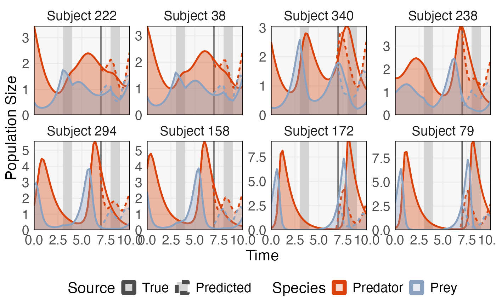
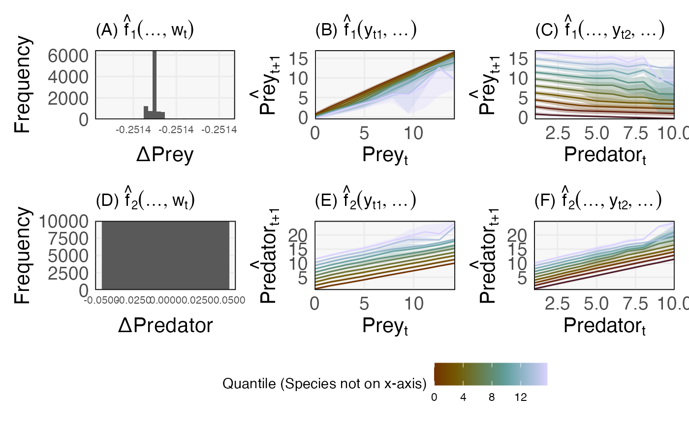

# Example with Generalized Lotka Volterra

``` r

library(glue)
library(mbtransfer)
library(patchwork)
library(scico)
library(seqtime)
library(tidyverse)
library(DALEX)
theme_set(tfPaper::my_theme())
set.seed(20240404)
```

An example with perturbations.

``` r

ts <- simulate_oscillator(perturb = TRUE) |>
  to_ts()
fit <- mbtransfer(ts[, 1:35], 1, 1, alpha = 1e-2, lambda = 1e-2, eta = 0.01, nrounds = 5e3)
ts_missing <- subset_values(ts, 1:35)
ts_preds <- predict(fit, ts_missing)
```

``` r

errors <- list()
diff <- ts_preds - ts
for (i in seq_along(diff)) {
  errors[[i]] <- mean(abs(diff@series[[i]]@values))
}

ix <- order(unlist(errors))[c(1, 2, 124, 125, 249, 250, 499, 500)]
plot_ts(ts[ix], ts_preds[ix]) +
  guides(
    linetype = guide_legend(override.aes = list(linewidth = 2, col = "#4c4c4c")),
    col = guide_legend(override.aes = list(linewidth = 2))
  )
```



``` r

ggsave("glv_dynamics.tiff", width=11, height=5)
```

``` r

patches <- patchify_df(ts[ ,1:35], 1, 1, interaction = "search")
patches$x <- mbtransfer:::append_interactions(patches$x, patches$interactions)

ix <- sample(nrow(patches$x), 1e4)
explainer <- explain(fit@parameters[[1]], patches$x, patches$y[, 1])
#> Preparation of a new explainer is initiated
#>   -> model label       :  xgb.Booster  (  default  )
#>   -> data              :  16500  rows  10  cols 
#>   -> data              :  rownames to data was added ( from 1 to 16500 ) 
#>   -> target variable   :  Argument 'y' was a data frame. Converted to a vector. (  WARNING  )
#>   -> target variable   :  16500  values 
#>   -> predict function  :  yhat.default will be used (  default  )
#>   -> predicted values  :  No value for predict function target column. (  default  )
#>   -> model_info        :  package Model of class: xgb.Booster package unrecognized , ver. Unknown , task regression (  default  ) 
#>   -> predicted values  :  numerical, min =  -10.621 , mean =  1.025917 , max =  13.59411  
#>   -> residual function :  difference between y and yhat (  default  )
#>   -> residuals         :  numerical, min =  -11.37693 , mean =  -0.00185844 , max =  10.63139  
#>   A new explainer has been created!
cp_profile <- predict_profile(explainer, patches$x[ix, ])
tax1 <- plot_cp_profile(cp_profile)
```

``` r

explainer <- explain(fit@parameters[[2]], patches$x, patches$y[, 1])
#> Preparation of a new explainer is initiated
#>   -> model label       :  xgb.Booster  (  default  )
#>   -> data              :  16500  rows  10  cols 
#>   -> data              :  rownames to data was added ( from 1 to 16500 ) 
#>   -> target variable   :  Argument 'y' was a data frame. Converted to a vector. (  WARNING  )
#>   -> target variable   :  16500  values 
#>   -> predict function  :  yhat.default will be used (  default  )
#>   -> predicted values  :  No value for predict function target column. (  default  )
#>   -> model_info        :  package Model of class: xgb.Booster package unrecognized , ver. Unknown , task regression (  default  ) 
#>   -> predicted values  :  numerical, min =  -0.1353985 , mean =  2.03721 , max =  20.03925  
#>   -> residual function :  difference between y and yhat (  default  )
#>   -> residuals         :  numerical, min =  -20.02886 , mean =  -1.013151 , max =  10.67419  
#>   A new explainer has been created!
cp_profile <- predict_profile(explainer, patches$x[ix, ])
tax2 <- plot_cp_profile(cp_profile)
```

``` r

((tax1[[1]] + labs(x = "ΔPrey", y = "Frequency", title = expression("(A)"~ hat(f)[1](..., w[t])))) +
 (tax1[[2]] + labs(x = expression(Prey[t]), y = expression(hat(Prey)[t + 1]), fill = "Quantile (Species not on x-axis)", col = "Quantile (Species not on x-axis)", title = expression("(B)" ~ hat(f)[1](y[t1], ...)))) +
 (tax1[[3]] + labs(x = expression(Predator[t]), y = expression(hat(Prey)[t + 1]), fill =  "Quantile (Species not on x-axis)", col = "Quantile (Species not on x-axis)", title = expression("(C)" ~ hat(f)[1](..., y[t2], ...))))) /
 ((tax2[[1]] + labs(x = "ΔPredator", y = "Frequency", title = expression("(D)"~ hat(f)[2](..., w[t])), fill =  "Quantile (Species not on x-axis)", col = "Quantile (Species not on x-axis)")) +
 (tax2[[2]] + labs(x = expression(Prey[t]), y = expression(hat(Predator)[t + 1]), fill =  "Quantile (Species not on x-axis)", col = "Quantile (Species not on x-axis)", title = expression("(E)" ~ hat(f)[2](y[t1], ...)))) +
 (tax2[[3]] + labs(x = expression(Predator[t]), y = expression(hat(Predator)[t + 1]), fill =  "Quantile (Species not on x-axis)", col = "Quantile (Species not on x-axis)", title = expression("(F)" ~ hat(f)[2](..., y[t2], ...))))) +
  plot_layout(guides = "collect")
```



``` r

ggsave("glv_profiles.tiff", width=10, height=6)
```
